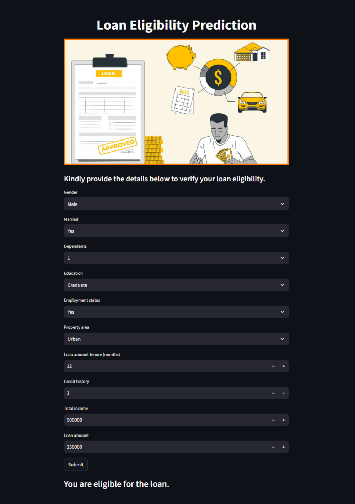

# Loan Eligibility Prediction Streamlit Application

This Streamlit application demonstrates an implementation of Loan Eligibility Prediction using Streamlit as a front end library.

## Demo Picture

See the project demo page [here](https://rohitmtak-loan-eligibility-prediction-app-vmzyik.streamlit.app/)!

## Learning

Exploring this application will help developers familiarize themselves with building machine learning models for loan eligibility prediction. It showcases how to preprocess data, train a machine learning model, and deploy it using Streamlit for interactive visualization.

## Getting Started

1. You need to have Python and pip installed.

2. Clone the repo `https://github.com/rohitmtak/loan-eligibility-prediction.git`

3. Install the required dependencies by running `pip install -r requirements.txt`.

4. Run `streamlit run app.py` in the terminal to launch the application in your web browser.

## Contributing

This project welcomes contributions and suggestions.

Happy Learning!

## Github: 
https://github.com/rohitmtak

## Contact
Rohit Tak - [rohitmtak@gmail.com](rohitmtak@gmail.com)